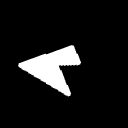
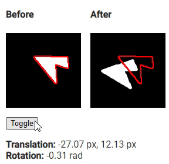

# Постановка задачи

Найти трансляцию и поворот объекта на картинках "до" и "после" относительно друг друга.


_До_



_После_

# Решение

Решение представлено в файлах `./calc/**/*`, а для проверки, соответственно, в `./demo/**/*`.

Для запуска необходима платформа [nodejs](https://nodejs.org):

```bash
# расчёт параметров
npm run calc

# запуск демо в live-режиме
npm run demo:serve

# сборка демо в статические файлы
npm run demo:build
```

# Ответ

Трансляция: -27.07 px, 12.13 px

Вращение: -0.31 rad



_Проверка решения_
